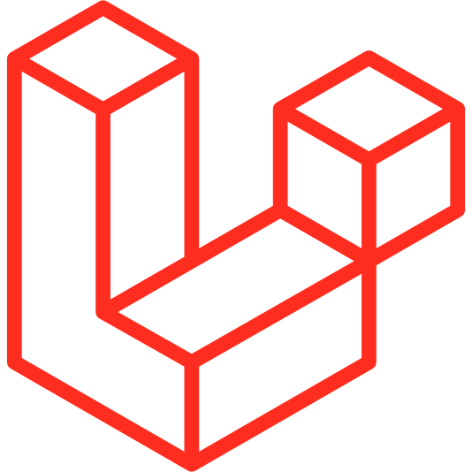

# Laravel Component for Diploi

Launch a trial, no account needed
https://diploi.com

Uses the official [FrankenPHP](https://hub.docker.com/r/dunglas/frankenphp) Docker image.

## Operation

### Getting started

1. In the Dashboard, click **Create Project +**
2. Under **Pick Components**, choose **Laravel (PHP)**

    You can add other frameworks from this page if you want to create a monorepo application, eg, Laravel + (React + Vite for frontend).

3. In **Pick Add-ons**, select any databases or extra tools you need.
4. Choose **Create Repository** so Diploi generates a new GitHub repo for your project.
5. Click **Launch Stack**

Check the guide https://docs.diploi.com/

### Development

Will run `composer install --optimize-autoloader --no-interaction` when component is first initialized, and `frankenphp php-server` when deployment is started.

### Production

Will build a production ready image. Image runs `composer install --no-dev --optimize-autoloader --no-interaction` when being created. Once the image runs, `frankenphp php-server` is called.

## Links

-   [Laravel documentation](https://laravel.com/docs)

